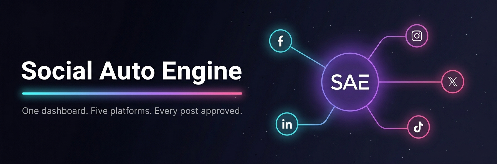

<p align="center">
  
</p>

<p align="center">
  <a href="#quick-start"></a>
  <a href="LICENSE"></a>
  <a href="docs/specs/2026-05-02-multi-channel-platform-master-plan.md"></a>
  <a href="#help-wanted"></a>
  <a href="#"></a>
</p>

<h2 align="center">The open-source operating system for your social media.</h2>

<p align="center">
<b>Buffer + Jasper, but you actually own it.</b><br>
Write once, publish to <b>Facebook</b>, <b>Instagram</b>, <b>WhatsApp</b>, <b>LinkedIn</b>, <b>X</b>, and <b>TikTok</b>. AI drafts in your voice. You approve every post. The system publishes it. Scales from one personal page to one hundred client accounts.
</p>

<p align="center">
<sub>🚀 <code>git clone</code> • <code>pip install</code> • <code>python -m dashboard.app</code> → http://127.0.0.1:7651 • You're posting in 5 minutes.</sub>
</p>

---

## Why this exists

Most social media tools fall into two camps:

- **Schedulers** (Buffer, Hootsuite, Later) — great at queuing, terrible at content. You still write everything yourself.
- **AI writers** (Jasper, Copy.ai) — great at drafts, terrible at execution. They don't post anywhere.

Social Auto Engine is the missing middle. The AI knows your voice (because you trained it on your samples), the dashboard knows your platforms (because every account is connected), and a human approves every single thing before it leaves the door. No silent automation. No "trust the algorithm." Just a faster version of the workflow you'd run by hand.

**Pitch in one sentence:** It's the post pipeline a solo creator and a 100-page agency can run on the same software.

---

## What's inside

### The MCP server (`server.py` + 37 tools)
Drop-in tools for Claude Desktop, Claude Code, Cursor, or any MCP client. Post, schedule, fetch insights, manage comments, run bulk actions on your Facebook page from inside chat.

### 17 content skills (`skills/`)
Markdown workflows Claude executes. Build your voice, generate hooks, score drafts against your real performance data, reverse-engineer outlier reels, write captions, design graphics, plan a content matrix.

### Master plan (`docs/specs/`)
14-section design doc covering the full multi-channel architecture: dashboard, approval queue, AI provider routing, batch workflows for 100 pages, ad creation, analytics. Read it before you contribute.

---

## What works today

| Capability                           | Status            | Notes                                            |
|--------------------------------------|-------------------|--------------------------------------------------|
| Facebook publishing (text/image/video) | ✅ Working        | 37 Graph API tools, MCP-ready                   |
| Facebook insights & comments         | ✅ Working        | Including bulk hide/delete, sentiment filtering |
| Instagram publishing                 | ✅ Working        | Two-step container publish via Graph API         |
| WhatsApp Business messaging          | ✅ Working        | Templates + free-form text, image, document      |
| Approval queue dashboard             | ✅ Working        | Compose, approve/reject, toast notifications     |
| Settings & connection testing        | ✅ Working        | Live API health checks per platform              |
| Voice profile system                 | ✅ Working        | `voice-builder` skill produces about-me + voice |
| AI post writing in your voice        | ✅ Working        | Via skills: post-writer, post-formatter, hooks  |
| Post scoring vs real data            | ✅ Working        | Apify-backed, scores against your top 10%       |
| Reels reverse-engineering            | ✅ Working        | Apify scrape + Gemini 2.5 Flash analysis        |
| Graphic generation                   | ✅ Working        | HTML/CSS or AI infographic styles               |
| LinkedIn publishing                  | 🟡 In progress    | PR incoming (issue #5)                          |
| X / Twitter publishing               | 🟡 Adapter planned | Requires Pro tier ($200/mo)                    |
| TikTok publishing                    | 🟡 Adapter planned | Awaiting Content Posting API review            |
| Scheduler (cron queue)               | 🟡 Spec done       | Issue #4                                        |
| AI compose in dashboard              | 🟡 Spec done       | Issue #3                                        |
| Cross-platform analytics             | ⚪ Designed       | Phase 5 of the master plan                     |
| Ad boosting (Meta)                   | ⚪ Designed       | Phase 6 of the master plan                     |

---

## Quick start

### 1. Run the MCP server (Facebook tools, working now)

```bash
git clone https://github.com/Freespirits/social-auto-engine.git
cd social-auto-engine
pip install -r requirements.txt
```

Create a `.env` file (see [DEVELOPMENT.md](DEVELOPMENT.md) for full setup):

```env
FACEBOOK_PAGE_ID=your_page_id
FACEBOOK_ACCESS_TOKEN=your_long_lived_page_token
```

Add to `~/.config/Claude/claude_desktop_config.json` (or the Windows equivalent):

```json
{
  "mcpServers": {
    "social-auto-engine": {
      "command": "python",
      "args": ["/absolute/path/to/social-auto-engine/server.py"],
      "env": {
        "FACEBOOK_PAGE_ID": "...",
        "FACEBOOK_ACCESS_TOKEN": "..."
      }
    }
  }
}
```

Restart Claude Desktop. Try: *"Show me my last 5 Facebook posts and their engagement."*

### 2. Use the skills (any Claude project)

Drop the `skills/` folder into a Claude project, then say:

- **"build my voice"** → walks you through the voice profile interview
- **"write a post about X"** → drafts in your voice with a chosen framework
- **"score my post"** → rates a draft against your real top performers
- **"script a reel"** → reverse-engineers a reference reel and writes yours

Each skill is a single SKILL.md file. Read it, edit it, fork it.

---

## Architecture in one picture

```
                 ┌──────────────────────────────────────────┐
                 │   Dashboard (FastAPI + HTMX + SQLite)    │
                 │   localhost:7651                         │
                 │   compose · inbox · accounts · analytics │
                 └──────────────────────────────────────────┘
                                     │
        ┌────────────────┬───────────┼───────────┬────────────────┐
        ▼                ▼           ▼           ▼                ▼
  ┌──────────┐    ┌──────────┐  ┌────────┐  ┌──────────┐    ┌──────────┐
  │ Approval │    │ Content  │  │ Voice  │  │Scheduler │    │Analytics │
  │  Queue   │    │ Generator│  │ Engine │  │          │    │          │
  └──────────┘    └──────────┘  └────────┘  └──────────┘    └──────────┘
        │                │           │           │                │
        └────────────────┴───────────┼───────────┴────────────────┘
                                     ▼
                  ┌────────────────────────────────────┐
                  │         Platform Adapters          │
                  │  FB · IG · WA · LinkedIn · X · TT  │
                  └────────────────────────────────────┘
```

Full breakdown — including SQL schemas, dashboard wireframes, AI provider routing, batch workflows for 100 pages, and the 6-phase roadmap — lives in **[docs/specs/2026-05-02-multi-channel-platform-master-plan.md](docs/specs/2026-05-02-multi-channel-platform-master-plan.md)**.

---

## Help wanted

This project is the size where one weekend from the right person changes the trajectory. Here's where you can pick up a meaningful chunk:

### 🎯 High-impact, ready to start

| Area                          | What                                                           | Skills needed                | Issue |
|-------------------------------|----------------------------------------------------------------|------------------------------|-------|
| **LinkedIn adapter**          | Mirror `instagram_api.py` shape for LinkedIn posting          | Python, OAuth 2.0            | [#5](https://github.com/Freespirits/social-auto-engine/issues/5) (assigned) |
| **Test suite**                | pytest + first round of tests (DB, dashboard, filters)        | Python, pytest               | [#6](https://github.com/Freespirits/social-auto-engine/issues/6) (assigned) |
| **AI compose**                | Wire Claude / OpenAI / Gemini into the compose textarea       | Python, LLM APIs             | [#3](https://github.com/Freespirits/social-auto-engine/issues/3) |
| **Scheduler**                 | Cron-driven publish queue with optimal-time suggestions       | Python, FastAPI              | [#4](https://github.com/Freespirits/social-auto-engine/issues/4) |
| **Token refresh**             | Long-lived token exchange + automatic rotation                | Python, Graph API            | [#2](https://github.com/Freespirits/social-auto-engine/issues/2) |

### 🧪 Solid second-tier

- X / TikTok adapters (each one is its own PR)
- Docker / docker-compose setup
- Dashboard auth (currently single-user)
- Cross-platform analytics collector
- Empty-state illustrations ([#7](https://github.com/Freespirits/social-auto-engine/issues/7))
- Documentation: per-skill docs, architecture decision records

### 💡 Got a different idea?

Open an issue with the label `proposal`. The master plan is the north star but it's not law — if you have a sharper take, make the case.

### 🔗 Standing on shoulders

We've curated 24 open-source projects that can accelerate this work. See [docs/integrations.md](docs/integrations.md). Top picks: Postiz (provider abstraction reference), CRUDAdmin (FastAPI+HTMX admin), python-statemachine (proper post lifecycle modeling).

### How to contribute

1. **Read** [the master plan](docs/specs/2026-05-02-multi-channel-platform-master-plan.md). Even a skim. It's the contract.
2. **Open an issue** describing what you want to build before you write code. Saves rework.
3. **Branch from main**, small focused PRs. One adapter per PR is fine.
4. **No silent automation.** If your change adds a write action, it must go through the approval queue or be opt-in with a warning. This is the project's spine.
5. **British English in user-facing copy.** No em dashes. Yes, even in PR descriptions. (You'll see why once you read voice.md.)

---

## Tech stack

- **Python 3.11+** — server, adapters, content pipeline
- **MCP (Model Context Protocol)** — tool layer, integrates with Claude / Cursor / any MCP client
- **FastAPI + HTMX + Jinja2** — dashboard (no SPA build step, no Node.js dependency)
- **SQLite (WAL mode)** — single-file persistence, zero ops
- **Apify** — Instagram / LinkedIn scraping for trend research and post-history scoring
- **AI providers** — Claude (via MCP), OpenAI GPT-4o, Gemini 2.5, DALL·E 3, ElevenLabs, HeyGen

---

## Project origins

Social Auto Engine merges two open-source projects:

- **[facebook-mcp-server](https://github.com/HagaiHen/facebook-mcp-server)** by Hagai Hen — MCP server with 37 Graph API tools and the approval queue spec.
- **[social-media-skills](https://github.com/charlie947/social-media-skills)** by [Charlie Hills](https://charliehills.substack.com) — 17 content skills behind a real 350k-follower content system.

Both still stand on their own. This repo is the integration: the MCP backbone meets the content pipeline meets a multi-channel dashboard.

---

## License

MIT. Use it, fork it, ship it commercially. Just don't pretend you wrote it from scratch — credit lives in [LICENSE](LICENSE) and the origin links above.

---

<p align="center">
  <i>Star the repo if you want this built faster. Open an issue if you want to build it with us.</i>
</p>
