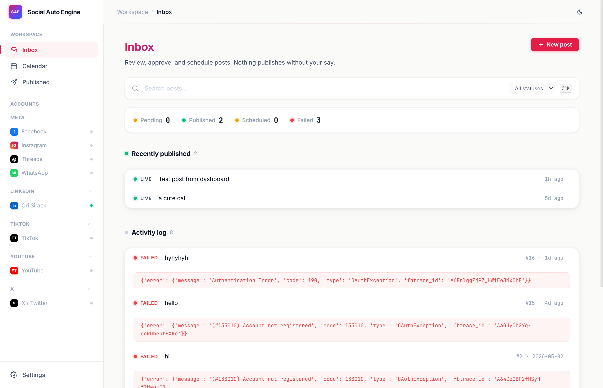
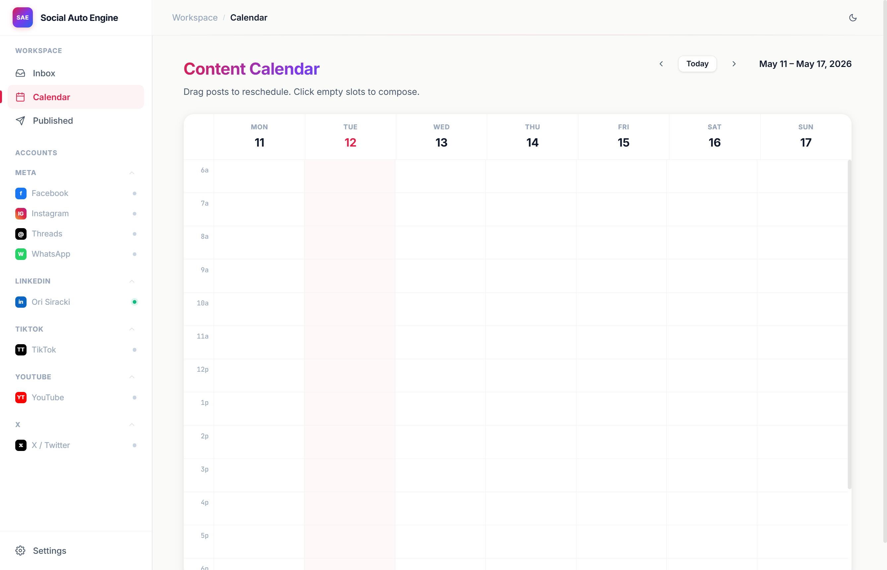
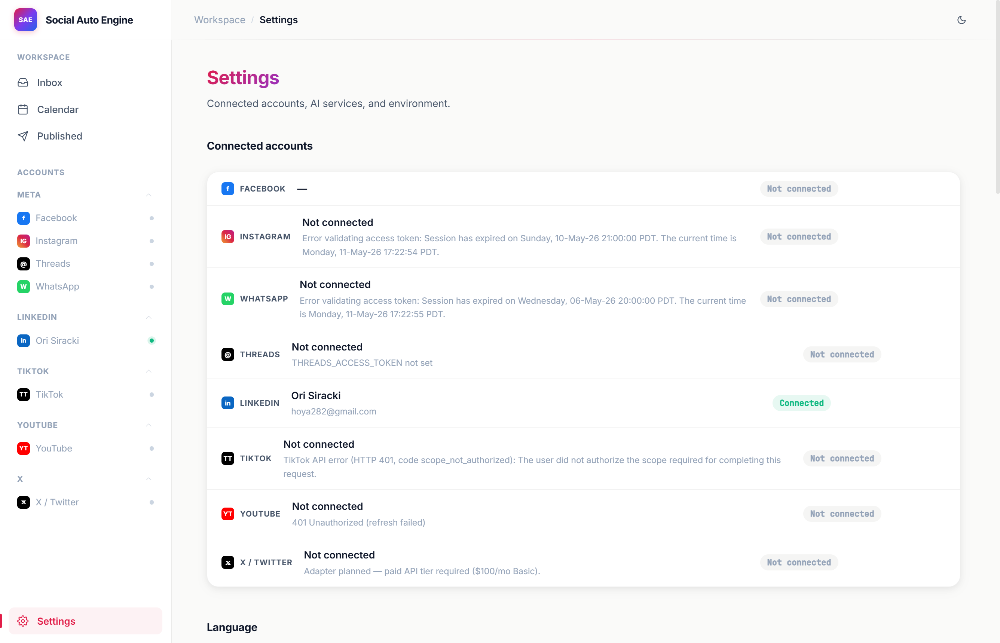
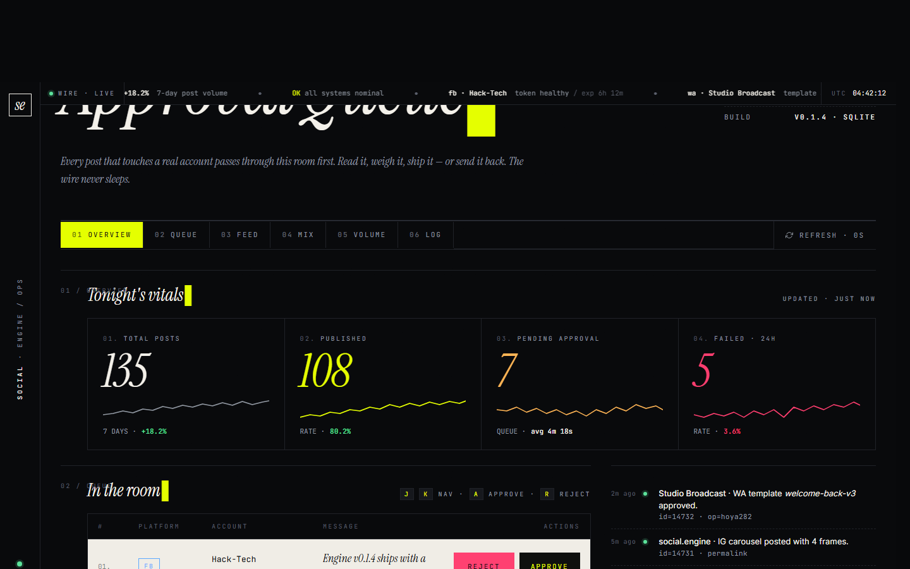

<p align="center">
  
</p>

<p align="center">
  <a href="https://freespirits.github.io/social-auto-engine/"></a>
  <a href="https://github.com/TensorBlock/awesome-mcp-servers/blob/main/docs/social-media--content-platforms.md"></a>
  <a href="#quick-start"></a>
  <a href="LICENSE"></a>
  <a href="docs/specs/2026-05-02-multi-channel-platform-master-plan.md"></a>
  <a href="#help-wanted"></a>
  <a href="#"></a>
</p>

<h2 align="center">The open-source operating system for your social media.</h2>

<p align="center">
<b>Buffer + Jasper, but you actually own it.</b><br>
Write once, publish to <b>Facebook</b>, <b>Instagram</b>, <b>Threads</b>, <b>WhatsApp</b>, and <b>LinkedIn</b> from a single dashboard. <b>TikTok</b> and <b>YouTube</b> adapters live in the codebase, awaiting their developer-app reviews. <b>X</b> is on the roadmap behind its paid API tier. AI drafts in your voice. You approve every post. The system publishes it. Scales from one personal page to one hundred client accounts.
</p>

<p align="center">
<sub>🚀 <code>git clone</code> • <code>pip install</code> • <code>python -m dashboard.app</code> → http://127.0.0.1:7651 • You're posting in 5 minutes.</sub>
</p>

---

## What it looks like

<table>
<tr>
<td width="33%" valign="top" align="center">
<a href="https://freespirits.github.io/social-auto-engine/"></a>
<br/>
<sub><b>Inbox</b> — the approval queue. Every draft lands here as pending. Approve, reject, edit, or schedule.</sub>
</td>
<td width="33%" valign="top" align="center">
<a href="https://freespirits.github.io/social-auto-engine/"></a>
<br/>
<sub><b>Calendar</b> — every connected account on one timeline. Drag to reschedule. Cancel before it fires.</sub>
</td>
<td width="33%" valign="top" align="center">
<a href="https://freespirits.github.io/social-auto-engine/"></a>
<br/>
<sub><b>Settings</b> — your keys, your data. Paste your own AI keys, save, test without restarting.</sub>
</td>
</tr>
</table>

<p align="center">
<sub>📺 Live demo: <a href="https://freespirits.github.io/social-auto-engine/">freespirits.github.io/social-auto-engine</a></sub>
</p>

---

## Why this exists

Most social media tools fall into two camps:

- **Schedulers** (Buffer, Hootsuite, Later) — great at queuing, terrible at content. You still write everything yourself.
- **AI writers** (Jasper, Copy.ai) — great at drafts, terrible at execution. They don't post anywhere.

Social Auto Engine is the missing middle. The AI knows your voice (because you trained it on your samples), the dashboard knows your platforms (because every account is connected), and a human approves every single thing before it leaves the door. No silent automation. No "trust the algorithm." Just a faster version of the workflow you'd run by hand.

**Pitch in one sentence:** It's the post pipeline a solo creator and a 100-page agency can run on the same software.

---

## Features

### Platform adapters — 5 live channels, 2 in code awaiting review

<table>
<tr>
<td width="25%" valign="top">

**Facebook**<br/>
`facebook_api.py` — 20 methods

- Text, image & video posts
- Scheduled (future) posts
- Edit & delete posts
- Post permalinks
- Page info & fan count
- Comment replies
- Hide / unhide comments
- Bulk hide / delete / unhide
- Negative sentiment filter
- Top commenters extraction
- Direct messages
- Full insights suite

</td>
<td width="25%" valign="top">

**Instagram**<br/>
`instagram_api.py` — 6 methods

- Image publishing (two-step container flow via Graph API)
- Reels publishing (video upload + publish)
- Recent media feed
- Media permalinks
- Account info (username, followers, media count)
- Linked to Facebook Page

</td>
<td width="25%" valign="top">

**WhatsApp Business**<br/>
`whatsapp_api.py` — 7 methods

- Free-form text messages
- Template messages (pre-approved by Meta)
- Image messages with caption
- Document sending (PDF, etc.)
- Template listing & filtering
- Account info & phone number
- Quality rating check

</td>
<td width="25%" valign="top">

**Threads**<br/>
`threads_api.py` — 13 methods

- Text posts with reply control
- Image posts
- Video posts
- Thread insights (views, likes, replies)
- Delete threads
- Full OAuth flow (auth URL, code exchange, long-lived token, refresh)
- Account info & permalinks

</td>
</tr>
</table>

---

### MCP server — 37 tools for Claude

`server.py` exposes every adapter method as an MCP tool. Drop it into Claude Desktop, Claude Code, Cursor, or any MCP-compatible client.

<details>
<summary><b>All 37 tools</b> (click to expand)</summary>
<br/>

**Publishing**
| Tool | What it does |
|---|---|
| `post_to_facebook` | Text post to your Page |
| `post_image_to_facebook` | Image + caption post |
| `schedule_post` | Schedule a post for future publish time |
| `update_post` | Edit an existing post's message |
| `delete_post` | Remove a post from the Page |
| `send_dm_to_user` | Direct message a user |

**Comments**
| Tool | What it does |
|---|---|
| `reply_to_comment` | Reply to a specific comment on a post |
| `get_post_comments` | Retrieve all comments on a post |
| `get_comment_replies` | Get reply thread on a comment |
| `get_number_of_comments` | Count comments on a post |
| `get_post_top_commenters` | Ranked list of most active commenters |
| `delete_comment` | Delete a comment |
| `delete_comment_from_post` | Delete by post + comment ID |
| `hide_comment` | Hide from public view |
| `unhide_comment` | Restore a hidden comment |
| `bulk_delete_comments` | Delete multiple comments at once |
| `bulk_hide_comments` | Hide multiple comments at once |
| `bulk_unhide_comments` | Unhide multiple comments at once |
| `filter_negative_comments` | Basic negative sentiment filter |

**Analytics & insights**
| Tool | What it does |
|---|---|
| `get_post_insights` | All metrics for a post (impressions, reactions, clicks) |
| `get_post_impressions` | Total impressions |
| `get_post_impressions_unique` | Unique impressions |
| `get_post_impressions_paid` | Paid impressions |
| `get_post_impressions_organic` | Organic impressions |
| `get_post_engaged_users` | Users who engaged |
| `get_post_clicks` | Click count |
| `get_number_of_likes` | Like count |
| `get_post_share_count` | Share count |
| `get_post_reactions_breakdown` | All reaction types in one call |
| `get_post_reactions_like_total` | Like reactions |
| `get_post_reactions_love_total` | Love reactions |
| `get_post_reactions_wow_total` | Wow reactions |
| `get_post_reactions_haha_total` | Haha reactions |
| `get_post_reactions_sorry_total` | Sad reactions |
| `get_post_reactions_anger_total` | Angry reactions |

**Page management**
| Tool | What it does |
|---|---|
| `get_page_posts` | Recent posts on the Page |
| `get_page_fan_count` | Total fans / likes |
| `get_page_info` | Extended Page metadata |
| `get_post_permalink` | Permanent URL of a post |
| `get_scheduled_posts` | All unpublished scheduled posts |

</details>

---

### Dashboard — approve everything before it ships

FastAPI + HTMX + Jinja2. No SPA, no Node.js, no build step. SQLite in WAL mode.

| Feature | How it works |
|---|---|
| **Multi-platform compose** | Write once, pick Facebook / Instagram / WhatsApp / Threads / LinkedIn |
| **AI compose studio** | Enhance, rewrite, TTS, captions, video gen, Notion sync. All from the compose toolbar. |
| **AI provider cascade** | Text AI auto-selects the first available provider: Grok > Bedrock > Ollama |
| **Inline API key management** | Paste keys in Settings, save and test without restarting |
| **Approval queue** | Every post lands in pending. Approve, reject, or approve-all |
| **Live publishing** | Approve > adapter publishes to the real platform API |
| **Toast notifications** | Success / failure feedback via HX-Trigger events |
| **Settings page** | Connected accounts, AI service cards, environment overview |
| **OAuth flows** | Threads, LinkedIn, TikTok, YouTube. Connect with one click. |
| **Connection health** | Per-platform API health check (token status, account info) |
| **Stats bar** | Pending / published / failed counts, always visible |
| **Image support** | Instagram requires image URL; stored per-post in SQLite |
| **WhatsApp templates** | Pick from Meta-approved templates or send free-form |
| **Recipient field** | WhatsApp messages route to a specific phone number |
| **Contextual video gen** | HiggsField auto-derives a video prompt from your post text |
| **HTMX partials** | Only the changed columns re-render, no full page reload |
| **Favicon** | Custom SVG favicon served at `/favicon.ico` |

<p align="center">
  
  <br>
  <sub>The approval queue dashboard. Editorial terminal aesthetic, real-time vitals, keyboard-driven workflow.</sub>
</p>

---

### AI services — 7 integrations, all optional

Every AI integration is optional, configured from the Settings page (paste keys, save, test), and stored in `~/.social-auto-engine/tokens.env`. No restart needed. The compose studio toolbar surfaces whichever services are configured.

| Service | What it powers | Key |
|---|---|---|
| **Grok (xAI)** | Prompt enhancement, post rewriting | `GROK_API_KEY` |
| **Amazon Bedrock** | Claude for text, SDXL for images, Titan | `AWS_ACCESS_KEY_ID` + `AWS_SECRET_ACCESS_KEY` |
| **Ollama** | Free local LLM fallback (no key needed) | `OLLAMA_BASE_URL` |
| **ElevenLabs** | Text-to-speech, voice cloning | `ELEVENLABS_API_KEY` |
| **Deepgram** | Speech-to-text, SRT captions | `DEEPGRAM_API_KEY` |
| **HiggsField / Replicate** | AI video generation (contextual from post text) | `REPLICATE_API_TOKEN` |
| **Notion** | Sync drafts to a Notion database | `NOTION_ACCESS_TOKEN` |

**Text AI cascade.** Enhance and rewrite use the first available text provider: Grok > Bedrock > Ollama. Configure one and it works. Configure all three and you have automatic failover.

**Contextual video.** When you generate a video from the compose studio, the text AI writes a scene prompt from your post content so the video matches what you are publishing.

---

### Content skills — 17 AI workflows

Each skill is a single `SKILL.md` file in `skills/`. Drop the folder into any Claude project and trigger by name.

<details>
<summary><b>All 17 skills</b> (click to expand)</summary>
<br/>

**Voice & identity**
| Skill | Trigger | What it does |
|---|---|---|
| `voice-builder` | "build my voice" | Interview + 3-5 writing samples → `about-me.md` + `voice.md` |
| `newsletter-voice` | "build my newsletter voice" | Extends voice system to newsletter format with archetype selection |
| `profile-optimizer` | "optimize my profile" | Full LinkedIn rebuild: headline, about, experience, 4 image prompts |

**Writing**
| Skill | Trigger | What it does |
|---|---|---|
| `post-writer` | "write a post about X" | Drafts in your trained voice using about-me + voice files |
| `post-formatter` | "format this as PAS" | Applies PAS / AIDA / BAB / STAR / SLAY frameworks, 200-250 words |
| `hook-generator` | "write me hooks" | 6 two-line hook variations per topic, digit-heavy, "How I" format |
| `content-matrix` | "give me post ideas" | 32+ ideas from your pillars x 8 formats (Justin Welsh method) |
| `pinned-comment` | "pinned comment" | LinkedIn first-comment + matching image prompt |
| `quote-post` | "quote post" | Motivational quote + Gemini image prompt for the graphic |

**Visual content**
| Skill | Trigger | What it does |
|---|---|---|
| `graphic-designer` | "design a graphic" | Decides HTML/CSS structured graphic vs AI infographic |
| `gemini-carousel` | "build a carousel" | Slide-by-slide LinkedIn carousel via Gemini, 1080x1350 |
| `gemini-infographic` | "whiteboard infographic" | Hand-drawn whiteboard style prompt (480k impressions across 3 posts) |
| `youtube-thumbnail` | "thumbnail" | Branded YouTube thumbnail prompt from video title + reference photo |

**Research & scoring**
| Skill | Trigger | What it does |
|---|---|---|
| `post-scorer` | "score my post" | Scores draft against your real post performance data via Apify |
| `niche-research` | "research my niche" | Live browser research via Claude for Chrome — Reddit, X, Google |
| `reels-scripting` | "script a reel" | Scrapes reference Reel via Apify, analyses with Gemini, writes your script |

**Analytics**
| Skill | Trigger | What it does |
|---|---|---|
| `analytics-dashboard` | "analyse my linkedin" | LinkedIn export → interactive React dashboard + strategic analysis |

</details>

---

### Infrastructure & DX

| Feature | Details |
|---|---|
| **CI pipeline** | GitHub Actions — lint + test on every push |
| **Issue templates** | Bug report + feature request (YAML-based) |
| **PR template** | Structured checklist for every pull request |
| **`.env.example`** | Fully documented — every env var explained with setup links |
| **`DEVELOPMENT.md`** | Developer setup guide |
| **`CONTRIBUTING.md`** | Contribution rules, branch strategy, code style |
| **MIT license** | Use it commercially, fork it, ship it |
| **Design system** | `design-system/MASTER.md` — color tokens, typography, spacing |
| **Ops guide** | `docs/meta-survival-guide.md` — Meta Business Suite token walkthrough |

---

### Roadmap

| Feature | Status | Notes |
|---|---|---|
| LinkedIn publishing | 🟢 Live | Member posting (text, image, article) via UGC API. Connect via `/oauth/linkedin/start`. |
| Multi-platform broadcast composer | 🟢 Live | Compose once, fan out to N selected platforms. Per-platform partial-failure tolerated. ([design](docs/specs/2026-05-06-company-grouped-ui-and-multi-platform-compose-design.md)) |
| Company-grouped UI | 🟢 Live | Dashboard sidebar grouped by Meta / LinkedIn / TikTok / YouTube / X. |
| TikTok publishing | 🟡 Code complete, awaiting review | Inbox-upload tier (`video.upload` scope) shipped in `tiktok_api.py`. Direct-post tier requires full TikTok app review. Connect via `/oauth/tiktok/start`. |
| YouTube publishing | 🟡 Code complete, awaiting OAuth setup | Video upload via Data API v3 in `youtube_api.py`. Defaults `privacyStatus='private'` per the no-silent-automation spine. Connect via `/oauth/youtube/start`. |
| Scheduler (cron queue) | 🟢 Live | APScheduler + SQLite jobstore. |
| AI compose in dashboard | 🟢 Live | 7 AI services, cascade provider selection, contextual video gen. ([#3](https://github.com/Freespirits/social-auto-engine/issues/3)) |
| Token auto-refresh helper | 🟢 Live | Short-lived → long-lived user token exchange and Page-token derivation via `scripts/refresh_token.py`. ([#2](https://github.com/Freespirits/social-auto-engine/issues/2)) |
| Provider auth-error surfacing | 🟢 Live | AI provider 401s now render actionable inline UI instead of raw 500s. ([#28](https://github.com/Freespirits/social-auto-engine/issues/28)) |
| Empty-state illustrations | 🟢 Live | First-run empty states for inbox, calendar, and published feeds. ([#7](https://github.com/Freespirits/social-auto-engine/issues/7)) |
| Landing site (GitHub Pages) | 🟢 Live | WebGL-animated marketing page at [freespirits.github.io/social-auto-engine](https://freespirits.github.io/social-auto-engine/). |
| X / Twitter adapter | ⚪ Planned | Requires Basic tier ($100/mo) or Pro ($5,000/mo). Deferred until usage justifies the spend. |
| Cross-platform analytics | ⚪ Designed | Phase 5 of the master plan |
| Ad boosting (Meta) | ⚪ Designed | Phase 6 of the master plan |

<p align="center">
  
  <br>
  <sub>The approval queue dashboard — editorial terminal aesthetic, real-time vitals, keyboard-driven workflow.</sub>
</p>

---

## Quick start

### 1. Run the MCP server (Facebook tools, working now)

```bash
git clone https://github.com/Freespirits/social-auto-engine.git
cd social-auto-engine
pip install -r requirements.txt
```

Create a `.env` file (see [DEVELOPMENT.md](DEVELOPMENT.md) for full setup):

```env
FACEBOOK_PAGE_ID=your_page_id
FACEBOOK_ACCESS_TOKEN=your_long_lived_page_token
```

Add to `~/.config/Claude/claude_desktop_config.json` (or the Windows equivalent):

```json
{
  "mcpServers": {
    "social-auto-engine": {
      "command": "python",
      "args": ["/absolute/path/to/social-auto-engine/server.py"],
      "env": {
        "FACEBOOK_PAGE_ID": "...",
        "FACEBOOK_ACCESS_TOKEN": "..."
      }
    }
  }
}
```

Restart Claude Desktop. Try: *"Show me my last 5 Facebook posts and their engagement."*

### 2. Use the skills (any Claude project)

Drop the `skills/` folder into a Claude project, then say:

- **"build my voice"** → walks you through the voice profile interview
- **"write a post about X"** → drafts in your voice with a chosen framework
- **"score my post"** → rates a draft against your real top performers
- **"script a reel"** → reverse-engineers a reference reel and writes yours

Each skill is a single SKILL.md file. Read it, edit it, fork it.

---

## Architecture in one picture

```
                 ┌──────────────────────────────────────────┐
                 │   Dashboard (FastAPI + HTMX + SQLite)    │
                 │   localhost:7651                         │
                 │   compose · inbox · settings · calendar  │
                 └──────────────────────────────────────────┘
                          │                    │
        ┌─────────────────┤                    │
        ▼                 ▼                    ▼
  ┌──────────┐    ┌─────────────┐    ┌───────────────────┐
  │ Approval │    │  Scheduler  │    │   AI Services     │
  │  Queue   │    │ (APSched)   │    │  Grok · Bedrock   │
  └──────────┘    └─────────────┘    │  Ollama · 11Labs  │
        │                │           │  Deepgram · Repl.  │
        │                │           │  Notion            │
        │                │           └───────────────────┘
        └────────────────┤
                         ▼
          ┌────────────────────────────────────┐
          │         Platform Adapters          │
          │  FB · IG · WA · Threads · LinkedIn │
          │  TikTok · YouTube (in review)      │
          └────────────────────────────────────┘
```

Full breakdown — including SQL schemas, dashboard wireframes, AI provider routing, batch workflows for 100 pages, and the 6-phase roadmap — lives in **[docs/specs/2026-05-02-multi-channel-platform-master-plan.md](docs/specs/2026-05-02-multi-channel-platform-master-plan.md)**.

---

## Help wanted

This project is the size where one weekend from the right person changes the trajectory. Here's where you can pick up a meaningful chunk:

### 🎯 High-impact, ready to start

| Area                          | What                                                           | Skills needed                | Issue |
|-------------------------------|----------------------------------------------------------------|------------------------------|-------|
| **X / Twitter adapter**      | Mirror `instagram_api.py` shape for X posting                 | Python, OAuth 2.0            | Requires Basic tier ($100/mo) |
| **Docker setup**              | docker-compose for dashboard + dependencies                   | Docker, Docker Compose       | — |
| **Dashboard auth**            | Cookie-based password auth (in flight on `dashboard-addons`)  | Python, FastAPI              | — |
| **Cross-platform analytics**  | Unified metrics across FB, IG, Threads, LinkedIn              | Python, charting             | Phase 5 of master plan |
| **TikTok app review**         | Submit for direct-post tier (`video.publish` scope)           | Process, screencast          | — |
| **YouTube OAuth consent**     | Submit verification for Data API v3 publish scope             | Process, app verification    | — |

### ✅ Recently shipped

| Area | Status |
|---|---|
| **Landing site** | WebGL-animated marketing page on GitHub Pages at [freespirits.github.io/social-auto-engine](https://freespirits.github.io/social-auto-engine/). |
| **Token refresh helper** | Short-lived → long-lived exchange + Page-token derivation via `scripts/refresh_token.py`. [#2](https://github.com/Freespirits/social-auto-engine/issues/2) |
| **Provider auth-error UI** | AI provider 401s now render actionable inline messages instead of raw 500s. [#28](https://github.com/Freespirits/social-auto-engine/issues/28) |
| **Empty-state illustrations** | First-run empty states for inbox, calendar, and published feeds. [#7](https://github.com/Freespirits/social-auto-engine/issues/7) |
| **LinkedIn adapter** | Live. Member posting (text, image, article) via UGC API. [#5](https://github.com/Freespirits/social-auto-engine/issues/5) |
| **Test suite** | 190+ tests. DB, dashboard, adapters, AI services. [#6](https://github.com/Freespirits/social-auto-engine/issues/6) |
| **AI compose** | 7 AI services, cascade provider selection, contextual video gen. [#3](https://github.com/Freespirits/social-auto-engine/issues/3) |
| **Scheduler** | APScheduler + SQLite jobstore. [#4](https://github.com/Freespirits/social-auto-engine/issues/4) |

### 🧪 Solid second-tier

- TikTok direct-post tier (code complete, awaiting full app review)
- YouTube publishing (code complete, awaiting OAuth consent screen)
- Documentation: per-skill docs, architecture decision records
- Additional AI providers (OpenAI, Gemini) as cascade options

### 💡 Got a different idea?

Open an issue with the label `proposal`. The master plan is the north star but it's not law — if you have a sharper take, make the case.

### 🔗 Standing on shoulders

We've curated 24 open-source projects that can accelerate this work. See [docs/integrations.md](docs/integrations.md). Top picks: Postiz (provider abstraction reference), CRUDAdmin (FastAPI+HTMX admin), python-statemachine (proper post lifecycle modeling).

### How to contribute

1. **Read** [the master plan](docs/specs/2026-05-02-multi-channel-platform-master-plan.md). Even a skim. It's the contract.
2. **Open an issue** describing what you want to build before you write code. Saves rework.
3. **Branch from main**, small focused PRs. One adapter per PR is fine.
4. **No silent automation.** If your change adds a write action, it must go through the approval queue or be opt-in with a warning. This is the project's spine.
5. **British English in user-facing copy.** No em dashes. Yes, even in PR descriptions. (You'll see why once you read voice.md.)

---

## Tech stack

- **Python 3.11+** — server, adapters, content pipeline
- **MCP (Model Context Protocol)** — tool layer, integrates with Claude / Cursor / any MCP client
- **FastAPI + HTMX + Jinja2** — dashboard (no SPA build step, no Node.js dependency)
- **SQLite (WAL mode)** — single-file persistence, zero ops
- **APScheduler** — cron-driven scheduled publishing with SQLite jobstore
- **Apify** — Instagram / LinkedIn scraping for trend research and post-history scoring
- **AI providers** — Grok (xAI), Amazon Bedrock (Claude, SDXL), Ollama (local), ElevenLabs, Deepgram, HiggsField/Replicate, Notion

---

## Project origins

Social Auto Engine merges two open-source projects:

- **[facebook-mcp-server](https://github.com/HagaiHen/facebook-mcp-server)** by Hagai Hen — MCP server with 37 Graph API tools and the approval queue spec.
- **[social-media-skills](https://github.com/charlie947/social-media-skills)** by [Charlie Hills](https://charliehills.substack.com) — 17 content skills behind a real 350k-follower content system.

Both still stand on their own. This repo is the integration: the MCP backbone meets the content pipeline meets a multi-channel dashboard.

---

## License

MIT. Use it, fork it, ship it commercially. Just don't pretend you wrote it from scratch — credit lives in [LICENSE](LICENSE) and the origin links above.

---

<p align="center">
  <i>Star the repo if you want this built faster. Open an issue if you want to build it with us.</i>
</p>
